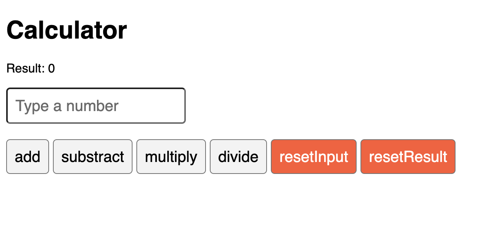

# Calculator Web Application

This project aims to build a basic calculator with simple operations like `add`, `substract`, `multiply` and `divide`.
The project has sanity checks like dividing by zero. It also provides buttons to reset input and outputs.

## Running the application

- Clone the repository using `git clone https://github.com/adityatodi/calculator.git`
- Change the directory to the project directory `cd calculator`
- Install `node_modules` using `npm install`
- Run the application using `npm run`

## Contributing to the Calculator

I encourage everyone to contribute and extend the application of this calculator to include other features like `power`, `log`, `expontent` or similar features.

- Code the changes following coding practices
- Have relevant documentation and update the ReadMe.md file accordingly
- Create a merge request
